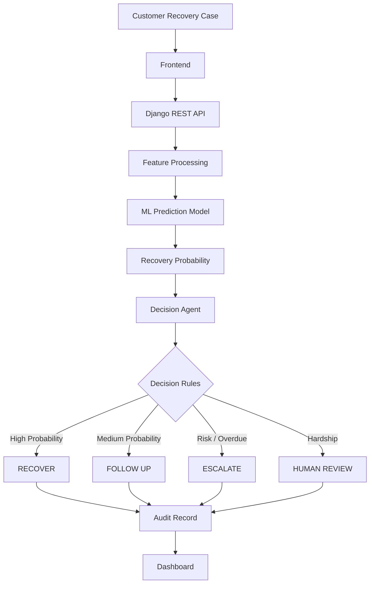
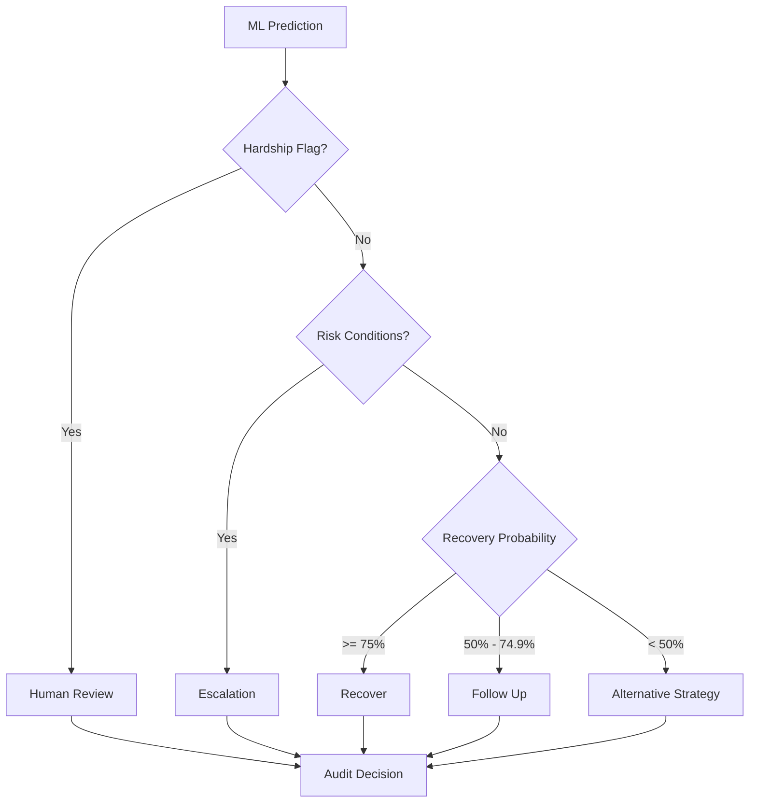
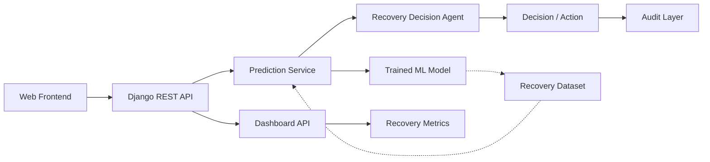
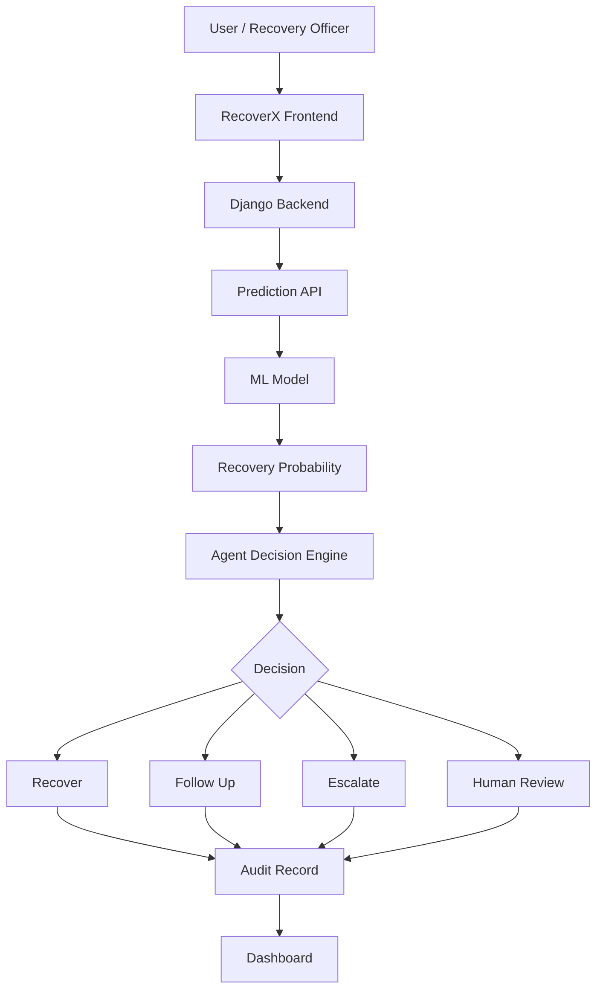

# RecoverX

## AI-Powered Revenue Recovery Decision System

> **Predict recovery. Prioritize action. Maintain control.**

RecoverX is an intelligent revenue recovery platform that combines **Machine Learning, decision automation, and auditability** to help prioritize overdue recovery cases.

The system predicts the probability of successful recovery, evaluates the case through a decision engine, and produces an actionable recommendation while maintaining a transparent audit trail.

---

## Executive Overview

RecoverX transforms recovery data into actionable decisions through a three-stage intelligence pipeline:

**Predict → Decide → Audit**

| Layer | Responsibility |
|---|---|
| Machine Learning | Predict recovery probability |
| Decision Agent | Determine the appropriate next action |
| Audit Layer | Record the decision and reasoning |
| Dashboard | Present recovery performance and case insights |

---

# Key Capabilities

- **Recovery Prediction** — estimates the likelihood of successful recovery
- **Intelligent Prioritization** — identifies cases requiring attention
- **Decision Automation** — converts predictions into recommended actions
- **Human Oversight** — supports human review for hardship or risk cases
- **Auditability** — records decisions, reasons, and automation status
- **Recovery Dashboard** — provides recovery performance insights
- **REST API** — connects the frontend with the prediction and decision services

---

# System Workflow



---

# Intelligent Decision Engine

RecoverX separates **prediction** from **action**.

The ML model answers:

> **How likely is this case to recover?**

The decision agent then answers:

> **What should happen next?**



---

# Machine Learning Layer

The ML layer processes recovery-related case features, including:

- Amount due
- Days overdue
- Monthly income
- Monthly expenses
- Payment history score
- Missed payments
- Previous recovery rate
- Contact success rate
- Last payment days ago
- Account age
- Reminders received
- Digital engagement
- Hardship flag
- Recovery days

The model produces:

| Output | Description |
|---|---|
| Recovery Probability | Estimated likelihood of successful recovery |
| Prediction | Recovery outcome classification |
| Recovery Level | High / Medium / Low |
| Recommended Action | Initial recommended follow-up |

### Example Prediction

```text
Recovery Probability : 95.5%
Prediction           : RECOVERY LIKELY
Recovery Level       : HIGH
Recommended Action   : High Priority Follow-up
```

---

# Agent Decision Layer

The prediction is passed to the RecoverX decision agent.

The agent evaluates the prediction and relevant case conditions to determine an appropriate action.

### Example Agent Result

```text
Agent Decision       : RECOVER
Action               : High Priority Recovery Reminder
Reason               : High predicted recovery probability
Automation Allowed   : TRUE
```

---

# Human-in-the-Loop

RecoverX supports controlled automation.

Cases that require additional attention can be routed for human review instead of being automatically processed.

Example:

```text
Agent Decision       : HUMAN_REVIEW
Automation Allowed   : FALSE
```

This provides a clear control point for recovery decisions.

---

# Auditability

Every important recovery decision can be recorded through an audit record.

The audit information includes:

- Case ID
- Timestamp
- Recovery probability
- Prediction
- Recovery level
- Agent decision
- Action
- Reason
- Automation status
- Stop reason

### Example

```json
{
  "case_id": 1,
  "recovery_probability": 95.5,
  "prediction": "RECOVERY LIKELY",
  "recovery_level": "HIGH",
  "agent_decision": "RECOVER",
  "action": "High Priority Recovery Reminder",
  "reason": "High predicted recovery probability",
  "automation_allowed": true
}
```

This makes the system easier to trace, evaluate, and explain.

---

# Dashboard

RecoverX includes a dashboard for viewing recovery-related metrics.

The dashboard can present information such as:

- Total cases
- Recovered cases
- Not recovered cases
- Recovery rate
- Average amount due
- Average days overdue
- Average recovery days

The dashboard provides a high-level view of recovery performance and case activity.

---

# Technical Architecture



---

# End-to-End Architecture



---

# Technology Stack

| Layer | Technology |
|---|---|
| Frontend | HTML, CSS, JavaScript |
| Backend | Python, Django |
| Machine Learning | Python, trained ML model |
| API | Django JSON API |
| Data | CSV |
| Dashboard | HTML / JavaScript |
| Version Control | Git / GitHub |

---

# Project Structure

```text
RecoverX/
│
├── backend/
│   └── recoverx_backend/
│       ├── manage.py
│       └── recoverx_backend/
│           ├── agent.py
│           ├── predict.py
│           ├── views.py
│           ├── urls.py
│           ├── settings.py
│           ├── asgi.py
│           └── wsgi.py
│
├── data/
│   └── recovery_data.csv
│
├── frontend/
│   ├── index.html
│   ├── dashboard.html
│   └── script.js
│
├── ml/
│   ├── generate_dataset.py
│   ├── train_model.py
│   ├── predict.py
│   └── recovery_model.pkl
│
├── notebooks/
│   └── 01_data_analysis.py
│
├── README.md
├── requirements.txt
└── .gitignore
```

---

# Running RecoverX Locally

## 1. Clone the repository

```bash
git clone https://github.com/Amina-Khatoon/RecoverX.git
cd RecoverX
```

## 2. Create a virtual environment

### Windows

```powershell
python -m venv venv
```

Activate the environment:

```powershell
venv\Scripts\activate
```

## 3. Install dependencies

```powershell
pip install -r requirements.txt
```

## 4. Start the Django backend

```powershell
cd backend\recoverx_backend
python manage.py runserver
```

The backend will run at:

```text
http://127.0.0.1:8000/
```

---

# API Endpoints

| Method | Endpoint | Purpose |
|---|---|---|
| GET | `/` | Backend health check |
| POST | `/api/predict/` | Generate recovery prediction |
| GET | `/api/dashboard/` | Retrieve dashboard information |

---

# Example End-to-End Result

### Prediction

```text
Recovery Probability : 95.5%
Prediction           : RECOVERY LIKELY
Recovery Level       : HIGH
Recommended Action   : High Priority Follow-up
```

### Agent

```text
Agent Decision       : RECOVER
Action               : High Priority Recovery Reminder
Automation Allowed   : TRUE
```

### Audit

```text
Case ID              : 1
Decision             : RECOVER
Recovery Probability : 95.5%
Audit Record         : Generated
```

---

# Core Concept

RecoverX connects three major intelligence layers:

```text
        ┌──────────────────┐
        │   PREDICT        │
        │   ML Model       │
        └────────┬─────────┘
                 │
                 ▼
        ┌──────────────────┐
        │   DECIDE         │
        │   Agent Engine   │
        └────────┬─────────┘
                 │
                 ▼
        ┌──────────────────┐
        │   AUDIT          │
        │   Decision Log   │
        └──────────────────┘
```

### Predict

**How likely is this case to recover?**

### Decide

**What should happen next?**

### Audit

**Why was this decision made?**

This transforms a machine learning prediction into an **action-oriented, controlled, and explainable recovery workflow**.

---

# Responsible Automation

RecoverX follows a controlled automation approach:

- Hardship cases can be routed to human review.
- Risk conditions can trigger escalation.
- Agent decisions are recorded.
- Automation status is explicitly tracked.
- Decisions can be reviewed through audit information.

The goal is **assisted decision-making rather than uncontrolled automation**.

---

# Future Scope

Potential future improvements include:

- Automated communication workflows
- Advanced recovery forecasting
- More sophisticated agent reasoning
- Real-time analytics
- Role-based access control
- Production database integration
- Cloud deployment
- Mobile-friendly recovery management
- Model monitoring and explainability
- Real-time notification and follow-up systems

---

# Project Objective

> **Turn recovery data into intelligent, explainable, and actionable decisions.**

---

## RecoverX

**AI-Powered Revenue Recovery Decision System**

**Python • Django • Machine Learning • JavaScript • GitHub**